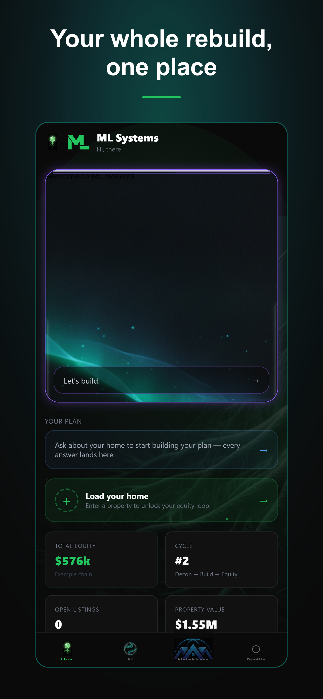
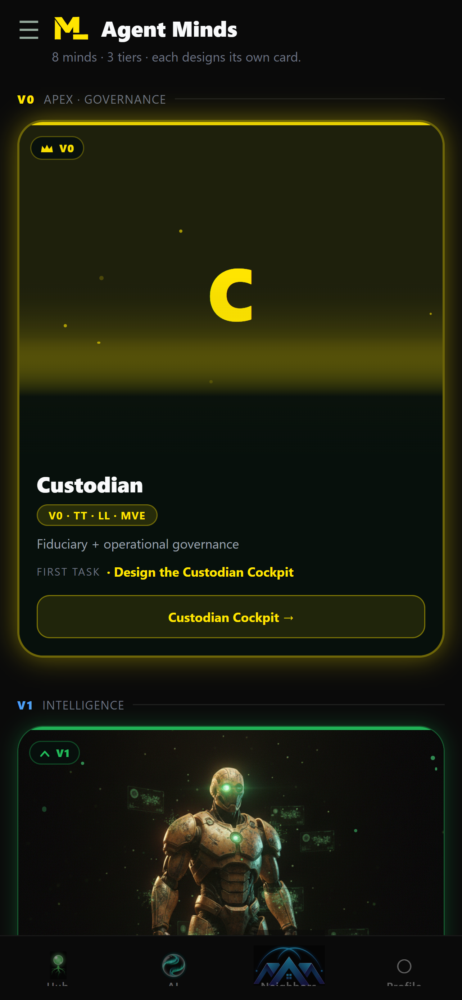

> # ⚠️ This repo has moved
>
> The canonical public ML Systems repository is now
> **[MLSystemsRI/ml-systems-public](https://github.com/MLSystemsRI/ml-systems-public)** —
> it contains the deep architecture docs (the Value Chain, the Master Ledger, the
> Collective Ontology, Ontological Compression, and the Seven Minds), the mobile app UI
> source, screenshots, and the SEO knowledge that used to live here. This repository is
> archived and read-only.

<div align="center">


# ML Systems

### Tougher Problems Inspire Creative Solutions

A construction-technology platform that guides a homeowner through the full value chain —
**access to capital → deconstruction → construction** — and closes the loop into equity.

[](https://mlsystemsri.com)
[](https://try.mlsystemsri.com)
[](https://play.google.com/store)

### ▶ Try the live demo — [try.mlsystemsri.com](https://try.mlsystemsri.com)

**No install needed.** The full ML Systems app runs in your browser — add a home from an address
and walk the value chain end to end.

</div>

---

## What it is

ML Systems is a Rhode Island construction company (NAICS 236115) building the software layer for
a new kind of homebuilding loop. Instead of demolition-and-landfill, a home is **deconstructed** —
its materials recovered and put back to their most valuable use — and then **rebuilt** larger and
better on the same lot. The homeowner reaches the capital markets to fund it, keeps building cycle
over cycle, and grows real equity from physical improvements rather than market speculation.

The app is the homeowner's guide through that journey.

## The value chain

```
   Loan Origination  ──▶  Deconstruction  ──▶  Construction  ──┐
   (access to capital)     (recover materials)   (rebuild bigger)  │
        ▲                                                          │
        └──────────────  equity loop: keep building  ◀────────────┘
```

| Stage | What happens |
|-------|--------------|
| **1 · Loan Origination** | A marketplace where lenders and capital-market participants compete to fund the homeowner — reaching capital they couldn't alone. |
| **2 · Deconstruction** | A crane-led sequence recovers materials and breaks each down to its most valuable recoverable state: **Reuse › Resale › Recycle**. |
| **3 · Construction** | Rebuild — expanding footprint and adding a level each cycle, reusing recovered materials. |
| **↺ · The loop** | Completed construction creates equity, which the homeowner can choose to reinvest into the next cycle. |

## The app

<div align="center">

| Home Hub | AI Guidance | Value Chain |
|:---:|:---:|:---:|
|  |  |  |
| **Equity** | **Material Store** | **The Minds** |
|  |  |  |

</div>

Homeowners create an account, add their home from just an address, and track progress across all
three phases — equity growth, recovered-material listings, and an AI guidance layer that walks the
build logic step by step.

## Under the hood

An orchestrated set of AI "minds," each responsible for a part of the journey — intake and property
records, deconstruction planning, material recovery, financing, and construction scheduling — working
from a shared, verifiable master ledger of what's known about each home.

**Built with:** React Native · Expo · TypeScript · tRPC · Next.js · Drizzle · PostgreSQL

## Neural-net architecture

The company organizes its thinking as three complementary "neural nets":

- **Physical** — Manual Labor → Measured Learning → Machine Learning (hands-on execution to automation)
- **Financial** — Language Modeler · Financial Architect · Accounting Engineer (strategy, capital, GAAP)
- **Community** — Events · Creativity · Generational Wealth (growth through the West Coast Swing dance community)

## Knowledge & data

This repo includes a public, AI-readable [`knowledge/`](knowledge/) layer — a company overview
(`llms.txt`, `ai-context.json`) and an [SEO data set](knowledge/seo/) (structured business profile,
SEO brief, and drop-in schema.org data). It's a deliberate **preview tranche**; the deeper
construction ontology, per-material provenance, and benchmarks are metered via the
[Transparency Trust Protocol](https://mlsystemsri.info).

## Links

- 🌐 Website — [mlsystemsri.com](https://mlsystemsri.com)
- 📲 Try the app in your browser — [try.mlsystemsri.com](https://try.mlsystemsri.com)
- 📱 Android — available on Google Play
- 🍎 iOS — coming to the App Store

## About

**Founder / Owner:** Sal · **Industry:** Construction (NAICS 236115) · **Location:** Rhode Island, USA

---

<div align="center">
<sub>© 2026 ML Systems LLC. This repository is a public overview of the ML Systems platform.
The application source code is proprietary.</sub>
</div>
